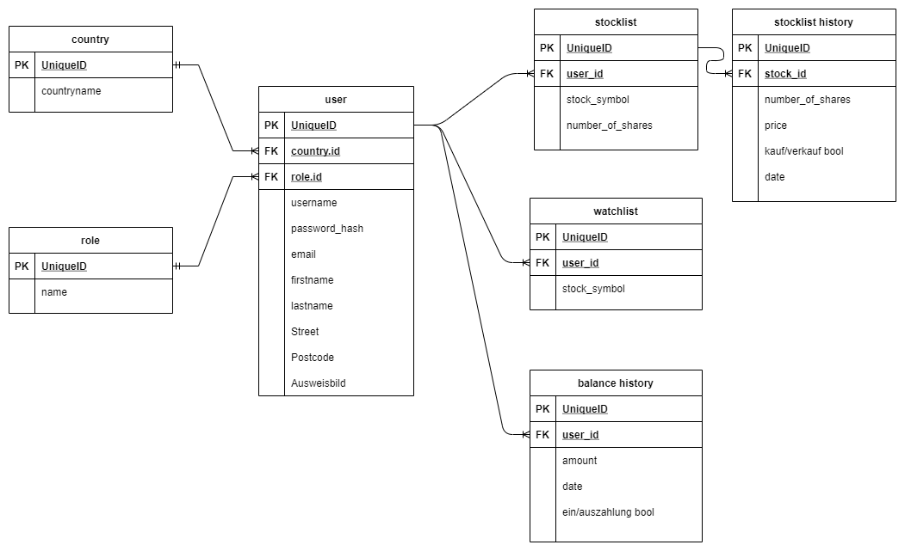

# WIFI Finance - ein WIFI Projekt
NOTE: momentan nur Stichwoerter, vollstaendinger Inhalt spaeter
## Inhaltsverzeichnis

## App Konzept

Broker

## Getting Started

- package installments
- vendor `/vendor/laravel/ui/auth-backend/RegistersUsers.php`
```
public function showRegistrationForm()
    {
        $countries = Country::select('id','country')->orderBy('country')->get();
        return view('auth.register', compact('countries'));
    }
 ```
- DB settings
    - migrate
    - db:seed

    